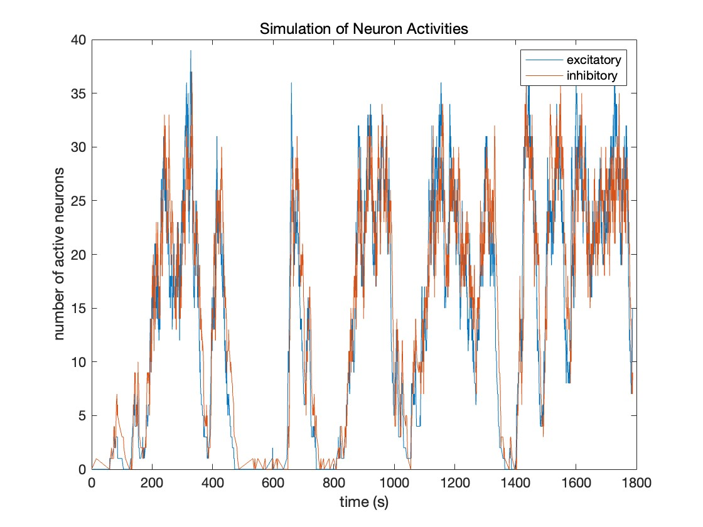

# Avalanches of Neurons Project Report

###### Ruirong Huang 12/08/2022

## Overview

The project is based on the paper

`Benayoun, M. Cowan, J.D. van Drongelen, W. Wallace, E. 2010. *Avalanches in a Stochastic Model of Spiking Neurons.* PLoS Computational Biology. Volume 6, Issue 7, e1000846.`

which simulated the avalanches of neurons by the Gillespie algorithm.


## Matlab Codes

Here is the codes I wrote

```matlab
% params
L = 100;
gamma = 0.1;
yita = 0.001;
deltaV = 0.1; % modify this
sumV = 0.004;
Ve = (deltaV + sumV) / 2;
Vi = sumV - Ve;

% init
y1 = 0;
y2 = 0;
t = 0;

% storage
t_track = [];
y1_track = [];
y2_track = [];

% simulation
for i = 1:10000

    % store
    t_track = [t_track, t];
    y1_track = [y1_track, y1];
    y2_track = [y2_track, y2];

    % synaptic input
    phi = Ve * y1 + Vi * y2 + yita;

    % propensities
    pi2 = gamma * y1;
    pi4 = gamma * y2;
    
    if phi > 0
        pi1 = (L/2 - y1) * tanh(phi);
        pi3 = (L/2 - y2) * tanh(phi);
    else
        pi1 = 0;
        pi3 = 0;
    end


    % sample from exponential distribution
    sum_pi = pi1 + pi2 + pi3 + pi4;
    mu = 1 / sum_pi;
    
    % choose delta_t
    tao = exprnd(mu);
    
    % choose reaction
    rand_val = rand * sum_pi;
    if rand_val < pi1()     % reaction 1
        y1 = y1 + 1;
    elseif rand_val < pi1() + pi2() % reaction 2
        y1 = y1 - 1;
    elseif rand_val < pi1() + pi2() + pi3() % reaction 3
        y2 = y2 + 1;
    else                    % reaction 4
        y2 = y2 - 1;
    end
    
    % update time
    t = t + tao;

end

% plot
figure
plot(t_track, y1_track, t_track, y2_track);
```


## Results

- Ve - Vi = 0


- Ve - Vi = 0.005


- Ve - Vi = 0.01




- Ve - Vi = 0.05


- Ve - Vi = 0.1


- Ve - Vi = 1


## Conclusion

We successfully simulated the avalanches of neurons by the Gillespie algorithm. The activities of excitatory and inhibitory neurons are similar. Once the network switch to synchronous mode, the avalanche pattern keeps stable and almost irrelevant to Ve - Vi.

